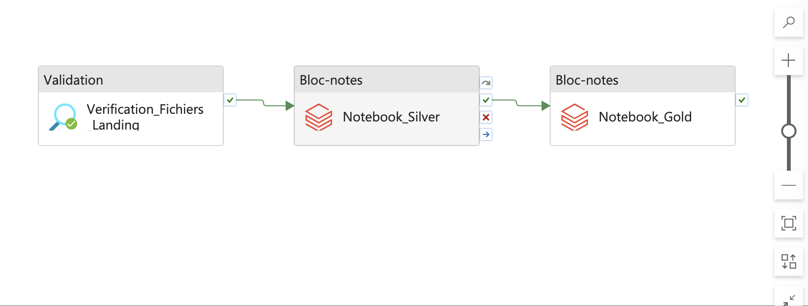
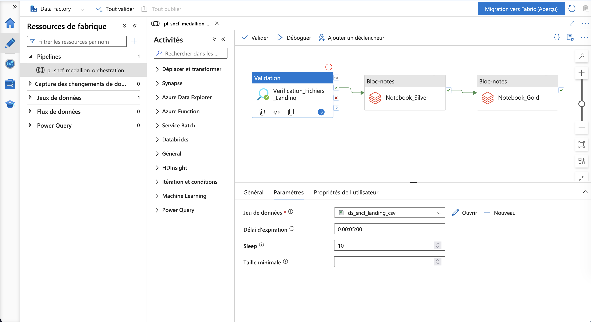
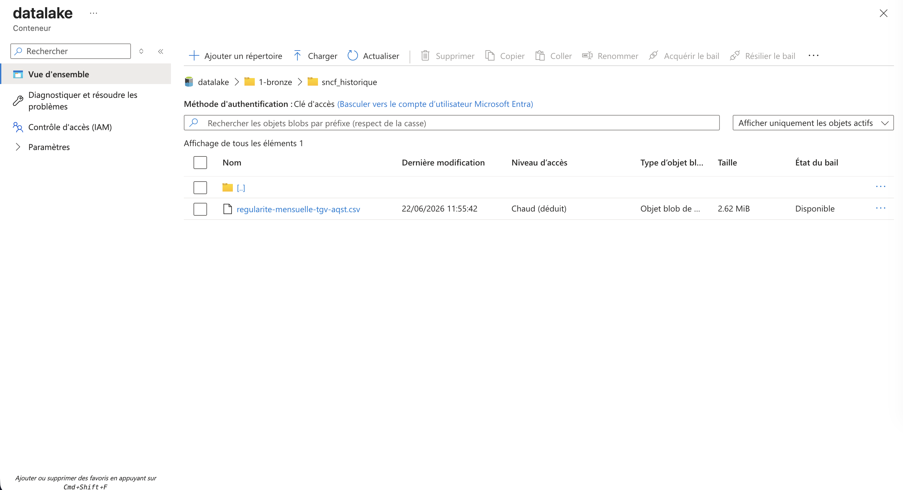
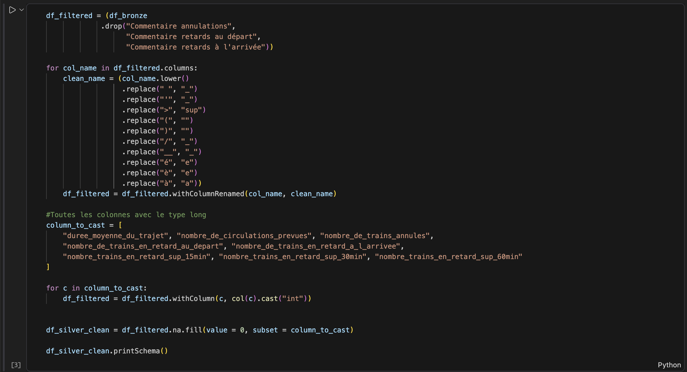

# Pipeline Data SNCF : Architecture Medallion sur Azure

## Objectif du Projet
Ce projet personnel a pour but de concevoir et d'orchestrer un pipeline de données complet pour traiter et analyser les données de la SNCF. Le flux de données repose sur les meilleures pratiques de l'**Architecture Medallion** (Bronze, Silver, Gold) et est entièrement structuré sur le cloud Microsoft Azure.

## Stack Technique
* **Orchestration :** Azure Data Factory (ADF)
* **Stockage :** Azure Data Lake Storage Gen2 (ADLS)
* **Calcul & Transformation :** Azure Databricks 
* **Langage :** Python / PySpark

---

## Architecture et Pipeline

Le flux de données est automatisé via Azure Data Factory et structuré en trois couches :
1. **Bronze (Raw) :** Réception des données brutes (fichiers CSV SNCF).
2. **Silver (Cleansed) :** Nettoyage, typage et standardisation des données avec PySpark.
3. **Gold (Curated) :** Agrégation et préparation des données pour l'analyse.

### 1. L'Orchestration Globale (ADF)
Le pipeline est conçu pour être robuste. Il intègre une logique de contrôle en amont pour éviter de démarrer des ressources de calcul inutilement.

### 2. Sécurité & Contrôle Qualité (Le Garde-fou)
L'activité de validation s'assure que le dossier source contient bien les données attendues avant de déclencher l'orchestration des Notebooks.

### 3. Stockage Data Lake (Couche Bronze)
Les données brutes atterrissent de manière sécurisée dans le premier conteneur du Data Lake.

### 4. Transformation des Données (PySpark)
Le cœur du traitement de la donnée : nettoyage et structuration via Databricks.

---

## Note sur l'état du déploiement (Limites d'infrastructure)

> L'architecture globale, la logique d'orchestration (ADF) et les scripts de transformation PySpark sont **100 % finalisés et validés**. 
> 
> Cependant, en raison des restrictions strictes de quotas de calcul imposées par l'abonnement *Azure for Students* (limite globale fixée à 6 vCPUs) et de la saturation matérielle temporaire des machines de génération `v2/v3` sur la région *France Central*, l'exécution complète du pipeline se trouve actuellement en attente d'une fenêtre de disponibilité des ressources Cloud. 
>
> C'est pourquoi le pipeline est présenté ici dans une configuration de **"Dry Run"**. Les dossiers `2-silver` et `3-gold` seront physiquement alimentés dès que l'allocation des nœuds de calcul Databricks sera autorisée par Azure. 
> 
> *Cette contrainte technique a été une excellente opportunité de mettre en pratique la gestion réelle des quotas Cloud (QuotaExceeded vs SkuNotAvailable), l'optimisation des coûts de calcul (Single Node cluster) et le troubleshooting d'infrastructure.*